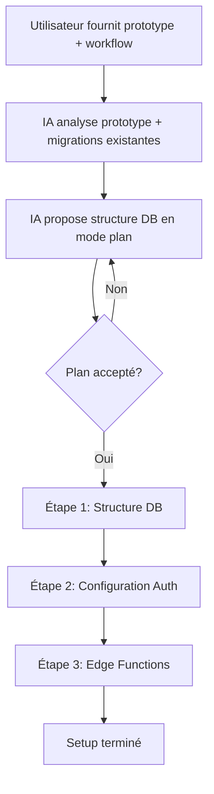

# Setup Supabase - Guide Interactif pour Cursor AI

> **Ce document est un guide de setup interactif destiné à être utilisé par Cursor AI en mode plan.**  
> L'IA exécutera toutes les actions via les **MCP Supabase** déjà configurés par l'utilisateur.  
> **Un setup Supabase bien fait permet d'économiser énormément de temps par la suite** — prenez le temps de bien configurer chaque étape.

---

## Prérequis

- **Projet Supabase déjà créé** : L'utilisateur doit avoir créé son projet Supabase au préalable
- **MCP Supabase configuré** : Les commandes MCP Supabase doivent être disponibles dans Cursor
- **Prototype/Code fourni** : L'utilisateur fournira un fichier avec la logique de son application (prototype)
- **Workflow (optionnel)** : L'utilisateur peut fournir une image/screenshot illustrant le workflow de son application

---

## Vue d'ensemble du Setup

Le setup Supabase se déroule en **2 phases principales** :

1. **Mode Plan** : L'IA analyse le prototype et propose une structure de base de données
2. **Mode Exécution** : Une fois le plan accepté, l'IA exécute 3 étapes distinctes



---

## Commandes MCP Supabase Disponibles

L'IA utilisera ces commandes MCP pour configurer Supabase automatiquement :

| Commande MCP | Description | Utilisation |
|-------------|-------------|-------------|
| `mcp_supabase_list_projects` | Lister tous les projets Supabase | Récupérer project_id |
| `mcp_supabase_get_project` | Détails d'un projet (ID, URL, status) | Récupérer project_id |
| `mcp_supabase_list_tables` | Lister les tables d'un projet | Vérification |
| `mcp_supabase_apply_migration` | Appliquer une migration SQL | Étape 1 |
| `mcp_supabase_execute_sql` | Exécuter du SQL directement | Étape 1 (si nécessaire) |
| `mcp_supabase_deploy_edge_function` | Déployer une Edge Function | Étape 3 |
| `mcp_supabase_list_edge_functions` | Lister les Edge Functions | Vérification |
| `mcp_supabase_get_logs` | Consulter les logs | Vérification |
| `mcp_supabase_get_project_url` | Récupérer l'URL du projet | Configuration |
| `mcp_supabase_get_publishable_keys` | Récupérer les clés API | Configuration |

---

## Phase 1 : Analyse et Proposition (Mode Plan)

### Objectif
Analyser le prototype fourni par l'utilisateur et proposer une structure de base de données adaptée.

### Actions de l'IA

#### 1.1 Récupérer le project_id

L'utilisateur a déjà créé son projet Supabase. L'IA doit :

```
Utiliser mcp_supabase_list_projects pour lister les projets
Demander à l'utilisateur quel projet utiliser (ou utiliser le premier si un seul)
Récupérer le project_id via mcp_supabase_get_project
```

#### 1.2 Analyser le Prototype Fourni

L'utilisateur fournit :
- **Un fichier avec la logique de l'application** (prototype, code, description)
- **Optionnellement : une image/screenshot** illustrant le workflow de l'application

L'IA doit analyser :
1. **Le prototype/fichier fourni** pour comprendre :
   - Les entités métier (users, products, orders, etc.)
   - Les relations entre entités
   - Les actions/opérations nécessaires
   - Les besoins en données

2. **L'image du workflow** (si fournie) pour visualiser :
   - Le flux utilisateur
   - Les interactions entre entités
   - Les étapes du processus

3. **Les migrations existantes du template** (`supabase/migrations/`) pour comprendre :
   - L'architecture de base (table `profiles`, `app_config`, `ai_prompts`)
   - Les patterns utilisés (RLS, triggers, indexes)
   - La structure standard à suivre

#### 1.3 Générer des Questions Dynamiques

L'IA doit **générer des questions pertinentes** basées sur l'analyse du prototype pour affiner la compréhension :
- Questions sur les entités identifiées
- Questions sur les relations entre entités
- Questions sur les permissions/accès
- Questions sur les fonctionnalités spécifiques

**Les questions ne sont PAS préparées à l'avance** — elles sont générées dynamiquement selon le contexte du prototype.

#### 1.4 Proposer la Structure de Base de Données

Après l'analyse et les questions, l'IA doit créer un **plan détaillé** incluant :

1. **Schéma visuel** (texte ou mermaid) montrant :
   - Les tables de base du template (`profiles`, `app_config`, `ai_prompts`)
   - Les tables custom proposées
   - Les relations entre tables (foreign keys)
   - Les indexes nécessaires

2. **Liste des migrations SQL** à créer :
   - Migration `000_profiles.sql` (si pas déjà créée)
   - Migrations custom pour chaque nouvelle table
   - Chaque migration avec : colonnes, contraintes, foreign keys, indexes, RLS policies, triggers

3. **Validation avec l'utilisateur** avant de passer à l'exécution

### Résultat attendu
- Un plan de structure de base de données validé par l'utilisateur
- Liste des migrations SQL à créer
- Prêt pour l'exécution des 3 étapes

---

## Phase 2 : Exécution (3 Étapes Distinctes)

Une fois le plan accepté, l'IA exécute **3 étapes distinctes et séquentielles**.

---

### Étape 1 : Structure de la Base de Données

#### Objectif
Créer toutes les tables et migrations nécessaires pour la structure de la base de données.

#### Actions de l'IA

1. **Créer la migration `000_profiles.sql`** (si pas déjà créée)

```sql
-- ============================================
-- Profiles Table
-- Extends auth.users with app-specific data
-- ============================================

CREATE TABLE IF NOT EXISTS profiles (
  id UUID PRIMARY KEY REFERENCES auth.users(id) ON DELETE CASCADE,
  email TEXT,
  customer_id TEXT,              -- Stripe customer ID
  price_id TEXT,                 -- Stripe price ID
  has_access BOOLEAN DEFAULT FALSE,
  role TEXT DEFAULT 'user' CHECK (role IN ('user', 'admin')),
  created_at TIMESTAMPTZ DEFAULT NOW(),
  updated_at TIMESTAMPTZ DEFAULT NOW()
);

-- Indexes
CREATE INDEX IF NOT EXISTS idx_profiles_email ON profiles(email);
CREATE INDEX IF NOT EXISTS idx_profiles_role ON profiles(role);
CREATE INDEX IF NOT EXISTS idx_profiles_customer_id ON profiles(customer_id);

-- RLS Policies
ALTER TABLE profiles ENABLE ROW LEVEL SECURITY;

-- Users can read their own profile
CREATE POLICY "Users can read own profile" ON profiles
  FOR SELECT USING (auth.uid() = id);

-- Users can update their own profile (except role)
CREATE POLICY "Users can update own profile" ON profiles
  FOR UPDATE USING (auth.uid() = id)
  WITH CHECK (auth.uid() = id);

-- Service role can do everything (for Edge Functions)
CREATE POLICY "Service role can manage profiles" ON profiles
  FOR ALL USING (auth.role() = 'service_role');

-- Trigger to create profile on user signup
CREATE OR REPLACE FUNCTION public.handle_new_user()
RETURNS TRIGGER AS $$
BEGIN
  INSERT INTO public.profiles (id, email)
  VALUES (NEW.id, NEW.email);
  RETURN NEW;
END;
$$ LANGUAGE plpgsql SECURITY DEFINER;

CREATE TRIGGER on_auth_user_created
  AFTER INSERT ON auth.users
  FOR EACH ROW EXECUTE FUNCTION public.handle_new_user();

-- Trigger to update updated_at
CREATE OR REPLACE FUNCTION update_profiles_timestamp()
RETURNS TRIGGER AS $$
BEGIN
  NEW.updated_at = NOW();
  RETURN NEW;
END;
$$ LANGUAGE plpgsql;

CREATE TRIGGER trigger_profiles_timestamp
  BEFORE UPDATE ON profiles
  FOR EACH ROW
  EXECUTE FUNCTION update_profiles_timestamp();
```

2. **Appliquer les migrations de base du template**

```
Utiliser mcp_supabase_apply_migration pour :
- 000_profiles.sql (si créée)
- 001_app_config.sql
- 002_ai_prompts.sql
```

3. **Créer et appliquer les migrations custom** (basées sur le plan)

Pour chaque table custom du plan, créer un fichier `supabase/migrations/003_[table_name].sql` (ou numéro suivant) en suivant le pattern standard :

```sql
-- ============================================
-- [Table Name] Table
-- [Description]
-- ============================================

CREATE TABLE IF NOT EXISTS [table_name] (
  id UUID PRIMARY KEY DEFAULT gen_random_uuid(),
  user_id UUID REFERENCES auth.users(id) ON DELETE CASCADE,
  -- Champs spécifiques selon le plan
  created_at TIMESTAMPTZ DEFAULT NOW(),
  updated_at TIMESTAMPTZ DEFAULT NOW()
);

-- Indexes
CREATE INDEX IF NOT EXISTS idx_[table_name]_user_id ON [table_name](user_id);
-- Autres indexes selon besoins

-- RLS Policies
ALTER TABLE [table_name] ENABLE ROW LEVEL SECURITY;

-- Policy: Users can read their own records
CREATE POLICY "Users can read own [table_name]" ON [table_name]
  FOR SELECT USING (auth.uid() = user_id);

-- Policy: Users can insert their own records
CREATE POLICY "Users can insert own [table_name]" ON [table_name]
  FOR INSERT WITH CHECK (auth.uid() = user_id);

-- Policy: Users can update their own records
CREATE POLICY "Users can update own [table_name]" ON [table_name]
  FOR UPDATE USING (auth.uid() = user_id)
  WITH CHECK (auth.uid() = user_id);

-- Policy: Users can delete their own records
CREATE POLICY "Users can delete own [table_name]" ON [table_name]
  FOR DELETE USING (auth.uid() = user_id);

-- Service role can do everything
CREATE POLICY "Service role can manage [table_name]" ON [table_name]
  FOR ALL USING (auth.role() = 'service_role');

-- Trigger to update updated_at
CREATE OR REPLACE FUNCTION update_[table_name]_timestamp()
RETURNS TRIGGER AS $$
BEGIN
  NEW.updated_at = NOW();
  RETURN NEW;
END;
$$ LANGUAGE plpgsql;

CREATE TRIGGER trigger_[table_name]_timestamp
  BEFORE UPDATE ON [table_name]
  FOR EACH ROW
  EXECUTE FUNCTION update_[table_name]_timestamp();
```

4. **Appliquer chaque migration custom**

```
Utiliser mcp_supabase_apply_migration pour chaque fichier créé
```

5. **Vérification**

```
Utiliser mcp_supabase_list_tables pour vérifier que toutes les tables sont créées
```

#### Résultat attendu
- Toutes les migrations appliquées avec succès
- Toutes les tables créées avec RLS activé
- Indexes et triggers en place

---

### Étape 2 : Configuration de l'Authentification

#### Objectif
Configurer l'authentification Supabase (email, OTP, templates).

#### Actions de l'IA

1. **Guider l'utilisateur pour activer la confirmation email**

   - Dashboard > Auth > Settings > Auth Settings
   - Activer **"Enable Email Confirmations"** (obligatoire en production)
   - Activer **"Double confirm email changes"** (recommandé)

2. **Guider l'utilisateur pour configurer les templates email**

   Dashboard > Auth > Email Templates :

   **Template "Confirm signup" (Inscription)** :

   ```html
   <h2>Bienvenue sur {{ .SiteName }} !</h2>
   <p>Votre code de vérification est :</p>
   <h1 style="font-size: 32px; letter-spacing: 8px; text-align: center; padding: 20px; background: #f1f5f9; border-radius: 8px; margin: 20px 0;">{{ .Token }}</h1>
   <p>Ce code expire dans 60 minutes.</p>
   <p>Si vous n'avez pas créé de compte, ignorez cet email.</p>
   ```

   **Template "Reset password" (Réinitialisation)** :

   ```html
   <h2>Réinitialisation du mot de passe</h2>
   <p>Vous avez demandé à réinitialiser votre mot de passe.</p>
   <p>Votre code de vérification est :</p>
   <h1 style="font-size: 32px; letter-spacing: 8px; text-align: center; padding: 20px; background: #f1f5f9; border-radius: 8px; margin: 20px 0;">{{ .Token }}</h1>
   <p>Ce code expire dans 60 minutes.</p>
   <p>Si vous n'avez pas fait cette demande, ignorez cet email.</p>
   ```

3. **Informer sur la limite SMTP**

   Le SMTP par défaut de Supabase a une limite de **4 emails/heure**. Pour la production, configurer un SMTP personnalisé (Resend, Postmark, SendGrid, etc.) via Dashboard > Settings > Auth > SMTP Settings.

#### Résultat attendu
- Confirmation email activée (guidée)
- Templates email configurés (guidés)
- Utilisateur informé de la limite SMTP par défaut

---

### Étape 3 : Configuration des Edge Functions

#### Objectif
Déployer toutes les Edge Functions de base du template.

#### Actions de l'IA

1. **Déployer les Edge Functions de base**

   **IMPORTANT : Toujours déployer avec `verify_jwt: false`**

   Les Edge Functions gèrent l'authentification **manuellement** via `_shared/auth.ts` (fonction `requireAuth()`).

   **Liste des fonctions de base à déployer** :

   | Fonction | Description | Auth |
   |----------|-------------|------|
   | `billing-create-checkout` | Créer session Stripe Checkout | JWT |
   | `billing-create-portal` | Créer session Customer Portal | JWT |
   | `billing-webhook` | Gérer webhooks Stripe | Signature Stripe |
   | `user-get-profile` | Récupérer profil utilisateur | JWT |
   | `ai-generate` | Générer contenu IA (OpenRouter) | JWT + Access |
   | `email-send` | Envoyer email (Resend) | Admin/Service |
   | `prompts-list` | Lister les prompts IA | Public |
   | `prompts-create` | Créer un prompt | Admin |
   | `prompts-update` | Modifier un prompt | Admin |
   | `prompts-delete` | Supprimer un prompt | Admin |
   | `storage-upload` | Upload fichier | JWT |
   | `storage-delete` | Supprimer fichier | JWT |
   | `config-get` | Lire configuration | Public |
   | `config-update` | Modifier configuration | Admin |

   **Pour chaque fonction** :

   ```
   Utiliser mcp_supabase_deploy_edge_function avec :
   - project_id: [le project_id]
   - function_name: [nom de la fonction]
   - verify_jwt: false
   - function_path: supabase/functions/[nom-fonction]/
   ```

2. **Vérification**

   ```
   Utiliser mcp_supabase_list_edge_functions pour vérifier que toutes les fonctions sont déployées
   ```

#### Résultat attendu
- Toutes les Edge Functions de base déployées avec `verify_jwt: false`
- Vérification réussie

---

## Section Référence

### Architecture Edge Functions

Les Edge Functions partagent un dossier `_shared/` contenant les helpers communs :

| Fichier | Rôle | Exports principaux |
|---------|------|--------------------|
| `_shared/auth.ts` | Vérification JWT et création de clients | `requireAuth(req)`, `requireAdmin(req)`, `getServiceClient()`, `getUserClient(token)` |
| `_shared/cors.ts` | Headers CORS et gestion preflight | `corsHeaders`, `handleCors()` |
| `_shared/deps.ts` | Dépendances centralisées | `createClient`, `User`, `SupabaseClient`, `Stripe`, `v` (valibot) |
| `_shared/response.ts` | Helpers de réponse standardisée | `success(data)`, `error(status, code, message)`, `errors.*()` |

### Format de Réponse Standard

```typescript
// Succès
{ ok: true, data: { ... } }

// Erreur
{ ok: false, error: { code: "ERROR_CODE", message: "...", details?: any } }
```

### Codes d'Erreur Standards

| Code | HTTP | Description |
|------|------|-------------|
| `UNAUTHORIZED` | 401 | Token manquant ou invalide |
| `FORBIDDEN` | 403 | Accès refusé (rôle insuffisant) |
| `BAD_REQUEST` | 400 | Paramètres manquants/invalides |
| `VALIDATION_ERROR` | 400 | Erreur de validation (détails dans `details`) |
| `NOT_FOUND` | 404 | Ressource non trouvée |
| `INTERNAL_ERROR` | 500 | Erreur serveur |

### CORS Headers

Les headers CORS sont définis dans `_shared/cors.ts` :

```typescript
export const corsHeaders = {
  "Access-Control-Allow-Origin": "*",
  "Access-Control-Allow-Headers": "authorization, x-client-info, apikey, content-type",
  "Access-Control-Allow-Methods": "GET, POST, PUT, DELETE, OPTIONS",
};
```

### Structure des Tables de Base

#### Table `profiles`

```sql
CREATE TABLE profiles (
  id UUID PRIMARY KEY REFERENCES auth.users(id) ON DELETE CASCADE,
  email TEXT,
  customer_id TEXT,              -- Stripe customer ID
  price_id TEXT,                 -- Stripe price ID
  has_access BOOLEAN DEFAULT FALSE,
  role TEXT DEFAULT 'user' CHECK (role IN ('user', 'admin')),
  created_at TIMESTAMPTZ DEFAULT NOW(),
  updated_at TIMESTAMPTZ DEFAULT NOW()
);
```

#### Table `app_config`

```sql
CREATE TABLE app_config (
  id UUID PRIMARY KEY DEFAULT gen_random_uuid(),
  key TEXT UNIQUE NOT NULL,
  value JSONB NOT NULL,
  category TEXT NOT NULL,
  description TEXT,
  created_at TIMESTAMPTZ DEFAULT NOW(),
  updated_at TIMESTAMPTZ DEFAULT NOW()
);
```

#### Table `ai_prompts`

```sql
CREATE TABLE ai_prompts (
  id UUID PRIMARY KEY DEFAULT gen_random_uuid(),
  name TEXT NOT NULL,
  description TEXT,
  content TEXT NOT NULL,
  created_at TIMESTAMPTZ DEFAULT NOW(),
  updated_at TIMESTAMPTZ DEFAULT NOW()
);
```

### Template Edge Function Complet

```typescript
/**
 * [function-name]
 * [Description]
 *
 * Auth: Required (JWT)
 * Method: POST
 * Body: { field1, field2 }
 */

import { requireAuth } from "../_shared/auth.ts";
import { handleCors } from "../_shared/cors.ts";
import { success, errors } from "../_shared/response.ts";

Deno.serve(async (req) => {
  // Handle CORS preflight
  if (req.method === "OPTIONS") {
    return handleCors();
  }

  try {
    // Verify authentication
    const { user, userClient, error: authError } = await requireAuth(req);
    if (authError || !user || !userClient) {
      return errors.unauthorized(authError || "Authentication required");
    }

    // Parse body
    const body = await req.json();
    const { field1, field2 } = body;

    // Validate input
    if (!field1 || !field2) {
      return errors.badRequest("Missing required fields: field1, field2");
    }

    // Business logic with userClient (respects RLS)
    const { data, error: dbError } = await userClient
      .from("table_name")
      .insert({ field1, field2, user_id: user.id })
      .select()
      .single();

    if (dbError) {
      console.error("Database error:", dbError);
      return errors.internal(dbError.message);
    }

    return success(data);
  } catch (err) {
    console.error("[function-name] error:", err);
    return errors.internal(err instanceof Error ? err.message : "Operation failed");
  }
});
```

### Troubleshooting

#### "Invalid token" / "Session expired"

**Cause** : Le SDK frontend utilise `fetch()` au lieu de `supabase.functions.invoke()`.

**Solution** : Vérifiez que le SDK utilise `callEdgeFunction()` depuis `_core.ts` qui utilise `invoke()` (géré automatiquement dans Kodefast).

#### "Function not found"

Déployez la fonction avec `verify_jwt: false` :

```
Utiliser mcp_supabase_deploy_edge_function avec verify_jwt: false
```

#### "CORS error"

Vérifiez que la fonction gère le preflight :

```typescript
if (req.method === "OPTIONS") {
  return handleCors();
}
```

Et que les headers CORS sont corrects (définis dans `_shared/cors.ts`).

#### "RLS policy error"

- Vérifiez que RLS est activé sur la table : `ALTER TABLE table_name ENABLE ROW LEVEL SECURITY;`
- Vérifiez vos politiques RLS
- Utilisez `userClient` (avec token) pour les requêtes RLS, pas `supabase` directement

#### "Migration failed"

- Vérifiez la syntaxe SQL
- Vérifiez que les tables référencées existent
- Vérifiez les contraintes (foreign keys, unique, etc.)

### Logs et Monitoring

**Consulter les logs via MCP** :

```
Utiliser mcp_supabase_get_logs avec :
- project_id: [le project_id]
- service: "api" | "postgres" | "edge-function" | "auth" | "storage"
```

**Services disponibles** :
- `api` - Logs de l'API REST
- `postgres` - Logs de la base de données
- `edge-function` - Logs des Edge Functions
- `auth` - Logs d'authentification
- `storage` - Logs du stockage

---

## Checklist de Setup Complet

### Phase 1 : Analyse et Plan
- [ ] Project_id récupéré
- [ ] Prototype/fichier analysé
- [ ] Image workflow analysée (si fournie)
- [ ] Migrations existantes analysées
- [ ] Questions dynamiques générées et posées
- [ ] Structure de base proposée et validée

### Phase 2 : Exécution

#### Étape 1 : Structure DB
- [ ] Migration `000_profiles.sql` créée et appliquée (si nécessaire)
- [ ] Migration `001_app_config.sql` appliquée
- [ ] Migration `002_ai_prompts.sql` appliquée
- [ ] Migrations custom créées et appliquées
- [ ] Tables vérifiées via `mcp_supabase_list_tables`

#### Étape 2 : Auth
- [ ] Confirmation email activée (guidée)
- [ ] Templates email configurés (guidés)

#### Étape 3 : Edge Functions
- [ ] Toutes les Edge Functions de base déployées avec `verify_jwt: false`
- [ ] Edge Functions vérifiées via `mcp_supabase_list_edge_functions`

---

**Setup terminé !** Votre projet Supabase est maintenant prêt à être utilisé. 🚀
